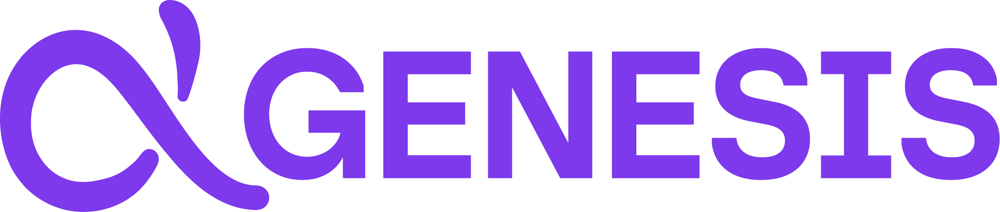

<div align="center">
  
</div>

# Genesis Frontend

Una aplicación web moderna diseñada para la interacción fluida con modelos de lenguaje (LLM) y la generación de código híbrido. Construida sobre **React** y **Vite**, Genesis proporciona una experiencia de usuario rica, soporte multimodal, y herramientas avanzadas de gestión de código.

> 🌐 **Descubre más:** Puedes visitar la [Landing Page de Genesis](https://fernandomartin.tech/genesis) para ver una presentación completa del proyecto.

> 🛠️ Este es el repositorio del Frontend de Genesis. Para las instrucciones de instalación paso a paso de todo el ecosistema, consulta el archivo [INSTALACION.md](./INSTALACION.md).

## 📑 Índice

- [✨ Características Destacadas](#-características-destacadas)
- [📂 Estructura del Proyecto](#-estructura-del-proyecto)
- [🏗️ Arquitectura y Componentes](#️-arquitectura-y-componentes)
- [🐛 Resolución de Problemas Comunes (Frontend)](#-resolución-de-problemas-comunes-frontend)

## ✨ Características Destacadas

### 💬 Experiencia de Chat Inteligente
- **Streaming en Tiempo Real:** Visualización instantánea de respuestas del LLM token a token.
- **Soporte Multimodal Inteligente:** Envía hasta 5 imágenes por mensaje. El sistema detecta y procesa diagramas UML automáticamente cuando usas modelos de visión compatibles.
- **Renderizado Markdown:** Resaltado de sintaxis enriquecido para más de 200 lenguajes.
- **Gestor de Código Dedicado:** Sidebar especializado para aislar, previsualizar, copiar y exportar (en ZIP) fragmentos de código generados en la conversación.
- **Auto-Scroll Inteligente:** Detecta si estás leyendo mensajes anteriores para no interrumpir tu lectura con nuevos fragmentos generados.

### 🔐 Autenticación y Seguridad
- **Sistema JWT Completo:** Registro, inicio de sesión, y renovación automática de tokens de acceso y refresco en segundo plano.
- **Sesiones Persistentes:** Almacenamiento seguro de estado. Si interactúas como usuario invitado, tus mensajes se guardan en *localStorage* y se sincronizan al iniciar sesión.

### 📂 Gestión Avanzada de Conversaciones
- **Organización Flexible:** Crea, edita, elimina y fija chats importantes.
- **Búsqueda Potente:** Encuentra conversaciones rápidamente por título (búsqueda parcial) o fechas en múltiples formatos (DD/MM/YYYY, etc.).
- **Títulos Automáticos:** El sistema genera nombres de chat descriptivos basados en el contexto de la conversación inicial mediante IA.

### 🎨 Diseño y UI
- **Tema Adaptable:** Soporte nativo para modo claro y oscuro basado en las preferencias del sistema o configuración manual.
- **Diseño Responsivo:** Interfaz adaptada a dispositivos móviles, tablets y escritorio.
- **Sidebar Colapsable:** Maximiza tu espacio de lectura y revisión de código ocultando el historial de chats cuando no lo necesites.

---

## 📂 Estructura del Proyecto

```text
frontend/
├── public/              # Recursos estáticos
├── src/
│   ├── App.jsx         # Componente raíz con enrutamiento
│   ├── main.jsx        # Punto de entrada de la aplicación
│   ├── assets/         # Imágenes, iconos, logos
│   ├── components/     # Componentes React
│   │   ├── Chat.jsx                  # Vista principal del chat
│   │   ├── ChatInput.jsx             # Input con selector de modelo e imágenes
│   │   ├── ChatMessage.jsx           # Renderizado de mensajes con Markdown
│   │   ├── ChatOptionsMenu.jsx       # Menú contextual de conversaciones
│   │   ├── CodeModal.jsx             # Modal para ver código en pantalla completa
│   │   ├── CodeSidebar.jsx           # Sidebar con snippets de código
│   │   ├── ImageDropdown.jsx         # Dropdown para gestionar imágenes
│   │   ├── ImageModal.jsx            # Modal para ver imágenes en grande
│   │   ├── ImageUploader.jsx         # Subida y preview de imágenes
│   │   ├── LeftSidebar.jsx           # Sidebar con lista de chats
│   │   ├── LoadingDots.jsx           # Animación de carga
│   │   ├── Login.jsx                 # Formulario de inicio de sesión
│   │   ├── ModelSelector.jsx         # Selector de modelos LLM
│   │   ├── Register.jsx              # Formulario de registro
│   │   ├── ThemeToggle.jsx           # Toggle de tema claro/oscuro
│   │   ├── UserProfile.jsx           # Perfil de usuario
│   │   └── UserProfileModal.jsx      # Modal de configuración de perfil
│   ├── css/            # Estilos CSS modulares (uno por componente)
│   └── services/       # Servicios y lógica de negocio
│       ├── api.service.js      # Cliente HTTP con autenticación automática
│       ├── auth.service.js     # Gestión de autenticación JWT
│       └── chat.service.js     # CRUD de conversaciones y mensajes
├── index.html          # HTML base
├── package.json        # Dependencias y scripts
├── vite.config.js      # Configuración de Vite
├── eslint.config.js    # Configuración de ESLint
├── README.md           # Este archivo
└── AUTHENTICATION.md   # Documentación detallada de autenticación
```

---

## 🏗️ Arquitectura y Componentes

La interfaz de Genesis se estructura en componentes modulares diseñados para maximizar la reusabilidad y el rendimiento.

```text
App.jsx
├── Login / Register
└── Chat principal
    ├── LeftSidebar: Historial
    ├── Chat: Mensajes y Streaming
    │   ├── ChatInput: Texto e Imágenes
    │   └── ChatMessage: Markdown
    └── CodeSidebar: Snippets
```

### Componentes Clave

- **`Chat.jsx`:** El corazón de la aplicación. Orquesta el estado global de la conversación, el streaming de mensajes, la generación de títulos automáticos y la sincronización pre/post autenticación.
- **`ChatMessage.jsx`:** Motor de renderizado. Utiliza `react-markdown` y `react-syntax-highlighter` para dar formato, aplicar temas dinámicos (vscDarkPlus/vs) y soportar diagramas UML embebidos (PlantUML).
- **`ModelSelector.jsx`:** Selector inteligente de LLMs. Se comunica con el backend para listar modelos disponibles y cuenta con un **Modo Auto** para delegar la selección al sistema según el contexto (texto vs. visión).
- **`ImageUploader.jsx` & `ImageDropdown.jsx`:** Sistema de gestión de adjuntos con soporte *drag & drop*, previsualización en miniatura, validación de modelos compatibles con visión y visor de tamaño completo.
- **`CodeSidebar.jsx`:** Panel extractor que analiza las respuestas, aísla bloques de código, genera nombres de archivo semánticos (basados en clases/funciones) y permite exportación individual o masiva.

## 🐛 Resolución de Problemas Comunes (Frontend)

Si encuentras dificultades específicas de la interfaz, revisa estas soluciones comunes:

#### 🔴 "Cannot connect to backend"
Verifica que tu API Gateway (Node.js) esté corriendo y responde en `http://localhost:3000/api/health`.

#### 🔴 Errores CORS
Asegúrate de que la variable `ALLOWED_ORIGINS` en el backend incluye `http://localhost:5173` (el puerto por defecto de Vite).

#### 🔴 La interfaz no renderiza código correctamente
Comprueba que los modelos que estás utilizando emiten bloques de código estándar en formato Markdown (```` ```lenguaje ... ``` ````).
