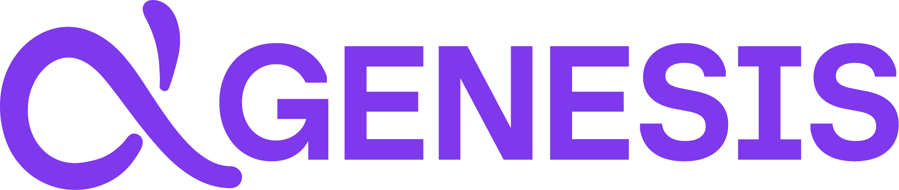

<div align="center">
  
</div>

# Genesis Frontend

A modern web application built for seamless interaction with language models (LLMs) and hybrid code generation. Built with **React** and **Vite**, Genesis delivers a rich user experience, multimodal support, and advanced code management tools.

> 🌐 **Learn more:** Visit the [Genesis landing page](https://fernandomartin.tech/genesis) for a full project overview.

> 🛠️ This is the Frontend repository for Genesis. For step-by-step installation instructions for the whole ecosystem, see [INSTALACION.md](./INSTALACION.md).

## 📑 Table of Contents

- [✨ Key Features](#-key-features)
- [📂 Project Structure](#-project-structure)
- [🏗️ Architecture & Components](#️-architecture--components)
- [🐛 Common Frontend Troubleshooting](#-common-frontend-troubleshooting)

## ✨ Key Features

### 💬 Intelligent Chat Experience
- **Real-Time Streaming:** Instant display of LLM responses token-by-token.
- **Smart Multimodal Support:** Send up to 5 images per message. The system detects and processes UML diagrams automatically when using compatible vision models.
- **Markdown Rendering:** Rich syntax highlighting for over 200 languages.
- **Dedicated Code Manager:** Sidebar to isolate, preview, copy, and export generated code snippets (ZIP support).
- **Smart Auto-Scroll:** Detects when you're reading older messages and avoids interrupting your view with new incoming content.

### 🔐 Authentication & Security
- **Full JWT System:** Registration, login, and background refresh of access and refresh tokens.
- **Persistent Sessions:** Secure state storage. Guest interactions are saved to localStorage and synced upon login.

### 📂 Advanced Conversation Management
- **Flexible Organization:** Create, edit, delete, and pin important chats.
- **Powerful Search:** Quickly find conversations by title (partial match) or dates in multiple formats (DD/MM/YYYY, etc.).
- **Automatic Titles:** The system generates descriptive chat names based on the initial conversation context using AI.

### 🎨 Design & UI
- **Adaptive Theme:** Native light/dark mode support based on system preference or manual toggle.
- **Responsive Layout:** Interface adapted for mobile, tablet, and desktop.
- **Collapsible Sidebar:** Maximize reading space by hiding chat history when not needed.
- **Multilingual Support:** Interface available in Spanish and English with instant language switching.

---

## 📂 Project Structure

```text
frontend/
├── public/              # Static assets
├── src/
│   ├── App.jsx         # Root component with routing
│   ├── main.jsx        # Application entrypoint
│   ├── assets/         # Images, icons, logos
│   ├── components/     # React components
│   │   ├── Chat.jsx                  # Main chat view
│   │   ├── ChatInput.jsx             # Input with model selector and image support
│   │   ├── ChatMessage.jsx           # Message rendering with Markdown
│   │   ├── ChatOptionsMenu.jsx       # Conversation context menu
│   │   ├── CodeModal.jsx             # Fullscreen code viewer modal
│   │   ├── CodeSidebar.jsx           # Sidebar with code snippets
│   │   ├── ImageDropdown.jsx         # Dropdown to manage images
│   │   ├── ImageModal.jsx            # Full-size image modal
│   │   ├── ImageUploader.jsx         # Upload and preview images
│   │   ├── LeftSidebar.jsx           # Sidebar with chat list
│   │   ├── LoadingDots.jsx           # Loading animation
│   │   ├── Login.jsx                 # Login form
│   │   ├── ModelSelector.jsx         # LLM selector
│   │   ├── Register.jsx              # Registration form
│   │   ├── ThemeToggle.jsx           # Light/dark theme toggle
│   │   ├── UserProfile.jsx           # User profile
│   │   └── UserProfileModal.jsx      # User profile modal
│   ├── css/            # Modular CSS styles (one per component)
│   ├── i18n/           # Internationalization and translations (ES/EN)
│   └── services/       # Services and business logic
│       ├── api.service.js      # HTTP client with automatic auth
│       ├── auth.service.js     # JWT authentication management
│       └── chat.service.js     # CRUD for conversations and messages
├── index.html          # Base HTML
├── package.json        # Dependencies and scripts
├── vite.config.js      # Vite configuration
├── eslint.config.js    # ESLint configuration
├── README.md           # This file
└── AUTHENTICATION.md   # Detailed authentication docs
```
---

## 🏗️ Architecture & Components

The Genesis UI is organized into modular components designed to maximize reusability and performance.

```text
App.jsx
├── Login / Register
└── Main Chat
  ├── LeftSidebar: History
  ├── Chat: Messages & Streaming
  │   ├── ChatInput: Text & Images
  │   └── ChatMessage: Markdown
  └── CodeSidebar: Snippets
```

### Key Components

- **Chat.jsx:** The heart of the application. Orchestrates global conversation state, message streaming, automatic title generation, and pre/post authentication sync.
- **ChatMessage.jsx:** Rendering engine. Uses `react-markdown` and `react-syntax-highlighter` for formatting, dynamic themes (vscDarkPlus/vs), and embedded UML diagrams (PlantUML).
- **ModelSelector.jsx:** Intelligent LLM selector. Communicates with the backend to list available models and includes an Auto Mode to delegate model choice based on context (text vs. vision).
- **ImageUploader.jsx & ImageDropdown.jsx:** Attachment management with drag & drop, thumbnail preview, model compatibility validation for vision models, and full-size viewer.
- **CodeSidebar.jsx:** Extractor panel that parses responses, isolates code blocks, generates semantic filenames (based on classes/functions), and allows single or bulk exports.

## 🐛 Common Frontend Troubleshooting

If you encounter UI-specific issues, check these common fixes:

#### 🔴 "Cannot connect to backend"
Verify your API Gateway (Node.js) is running and responding at `http://localhost:3000/api/health`.

#### 🔴 CORS Errors
Ensure the `ALLOWED_ORIGINS` variable in the backend includes `http://localhost:5173` (Vite default port).

#### 🔴 Interface doesn't render code correctly
Check that the models you are using emit standard code blocks in Markdown format (``` ```language ... ```).

---

<div align="center">
  
</div>

# Genesis Frontend

Una aplicación web moderna diseñada para la interacción fluida con modelos de lenguaje (LLM) y la generación de código híbrido. Construida sobre **React** y **Vite**, Genesis proporciona una experiencia de usuario rica, soporte multimodal, y herramientas avanzadas de gestión de código.

> 🌐 **Descubre más:** Puedes visitar la [Landing Page de Genesis](https://fernandomartin.tech/genesis) para ver una presentación completa del proyecto.

> 🛠️ Este es el repositorio del Frontend de Genesis. Para las instrucciones de instalación paso a paso de todo el ecosistema, consulta el archivo [INSTALACION.md](./INSTALACION.md).

## 📑 Índice

- [✨ Características Destacadas](#-características-destacadas)
- [📂 Estructura del Proyecto](#-estructura-del-proyecto)
- [🏗️ Arquitectura y Componentes](#️-arquitectura-y-componentes)
- [🐛 Resolución de Problemas Comunes (Frontend)](#-resolución-de-problemas-comunes-frontend)

## ✨ Características Destacadas

### 💬 Experiencia de Chat Inteligente
- **Streaming en Tiempo Real:** Visualización instantánea de respuestas del LLM token a token.
- **Soporte Multimodal Inteligente:** Envía hasta 5 imágenes por mensaje. El sistema detecta y procesa diagramas UML automáticamente cuando usas modelos de visión compatibles.
- **Renderizado Markdown:** Resaltado de sintaxis enriquecido para más de 200 lenguajes.
- **Gestor de Código Dedicado:** Sidebar especializado para aislar, previsualizar, copiar y exportar (en ZIP) fragmentos de código generados en la conversación.
- **Auto-Scroll Inteligente:** Detecta si estás leyendo mensajes anteriores para no interrumpir tu lectura con nuevos fragmentos generados.

### 🔐 Autenticación y Seguridad
- **Sistema JWT Completo:** Registro, inicio de sesión, y renovación automática de tokens de acceso y refresco en segundo plano.
- **Sesiones Persistentes:** Almacenamiento seguro de estado. Si interactúas como usuario invitado, tus mensajes se guardan en *localStorage* y se sincronizan al iniciar sesión.

### 📂 Gestión Avanzada de Conversaciones
- **Organización Flexible:** Crea, edita, elimina y fija chats importantes.
- **Búsqueda Potente:** Encuentra conversaciones rápidamente por título (búsqueda parcial) o fechas en múltiples formatos (DD/MM/YYYY, etc.).
- **Títulos Automáticos:** El sistema genera nombres de chat descriptivos basados en el contexto de la conversación inicial mediante IA.

### 🎨 Diseño y UI
- **Tema Adaptable:** Soporte nativo para modo claro y oscuro basado en las preferencias del sistema o configuración manual.
- **Diseño Responsivo:** Interfaz adaptada a dispositivos móviles, tablets y escritorio.
- **Sidebar Colapsable:** Maximiza tu espacio de lectura y revisión de código ocultando el historial de chats cuando no lo necesites.
- **Soporte Multilingüe:** Interfaz y aplicación disponibles en Español e Inglés, con cambio de idioma instantáneo.
